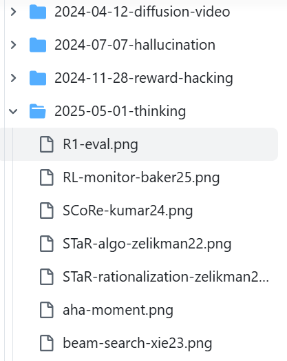

我的需求：

1.  能流畅地发布包含**数学公式**和**图片**的 Markdown 笔记。
2.  能方便地**在线访问**。
3.  最好能有一个简单的**评论功能**。

我注意到 [Lilian Weng](https://lilianweng.github.io/) 的博客，其简洁的设计正是我想要的。顺藤摸瓜，我发现她使用的是 Hugo 框架和 PaperMod 主题。

于是，技术选型就此敲定。具体搭建步骤如下：

**1. 站在巨人的肩膀上**

我直接 Fork 了一位大佬配置好的[模板](https://github.com/sherlcok314159/MyPaperMod)。然后将仓库名修改为 `x2x5.github.io`，GitHub Pages 的基础就有了。

**2. 安装 Hugo**

在本地环境安装 Hugo。这里有个重要的**避坑提示**：这个模板不能用最新的 v0.14x 版本，要用稍旧一些的 **v0.124** 版本。

**3. 公式渲染**

我平时习惯用 Typora 写作，公式都用 `$` 包裹，例如 `$a^2$`，写出来其实是 \\$a^2\\$。

在 Hugo 中，对于简单的行内公式（如 `$a_2$`）或独立的公式块，

$$a_2$$

，不加反撇号 `` ` `` 也能正常显示。但是，一旦遇到复杂公式，就会出问题。这时，要用反撇号将整个公式代码包裹起来。

**不加反撇号的复杂公式（可能会出错）：**
$$\frac{\partial E(\boldsymbol{w})}{\partial z_j} = \sum\limits_{k}\frac{\partial E(\boldsymbol{w})}{\partial y_{k}}\frac{\partial y_k}{\partial z_{j}}= \sum\limits_{k} (y_{k}- \hat{y}_{k}) w_{kj}^{(2)} \tag{5.11}$$

**推荐的写法（用反撇号包裹）：**

```latex
`$$
\frac{\partial E(\boldsymbol{w})}{\partial z_j} = \sum\limits_{k}\frac{\partial E(\boldsymbol{w})}{\partial y_{k}}\frac{\partial y_k}{\partial z_{j}}= \sum\limits_{k} (y_{k}- \hat{y}_{k}) w_{kj}^{(2)} \tag{5.11}
$$`
```
就会得到下面的公式：

`$$
\frac{\partial E(\boldsymbol{w})}{\partial z_j} = \sum\limits_{k}\frac{\partial E(\boldsymbol{w})}{\partial y_{k}}\frac{\partial y_k}{\partial z_{j}}= \sum\limits_{k} (y_{k}- \hat{y}_{k}) w_{kj}^{(2)} \tag{5.11}
$$`

我之前用 hugo 正常的方案，就做不到这一点，只能手动给公式里的下划线 `_` 添加转义符 `\`，那将是无尽的体力活。

因此，**“复杂公式加反撇号”** 这个方法方便多了，避免了我需要对一个很长的公式，不停的找哪里要加转义符。

**4. 评论系统**

原模板作者用的是 artalk（我也不懂这是啥），我猜这个东西是需要用自己的服务器。对于我这种只想白嫖 GitHub 的，最简单的方案是利用 **GitHub Discussions** 作为评论区。用了 giscus 方案，算是比较简单的。

**5. 内容管理：自动化与规范化**

为了让文章和图片管理得更像 Lilian Weng 那样井井有条，我写了一个简单的 Shell 脚本。每次执行 `hugo new` 命令时，它会自动创建一个以 `年-月-日-文章名` 命名的目录。




```bash
# 示例目录结构
content\posts\2025-06-12-math-test\image-20250612211115333.png
content\posts\2025-06-12-math-test\index.md
```

这样，每篇文章和它所引用的图片都存放在独立的文件夹内，结构清晰，管理方便。

typora 里选这个设置：


### 四、总结

至此，一个满足我所有核心需求的个人笔记博客总算搭建完成了。虽然过程曲折，但结果是喜人的。

现在，我可以继续使用习惯的 Typora 写笔记，写完后，对于复杂公式稍作处理，再通过几条命令就能发布上线。

对于更复杂的定制化需求，我暂时也懒得去探索了。能用就行。先这样吧！