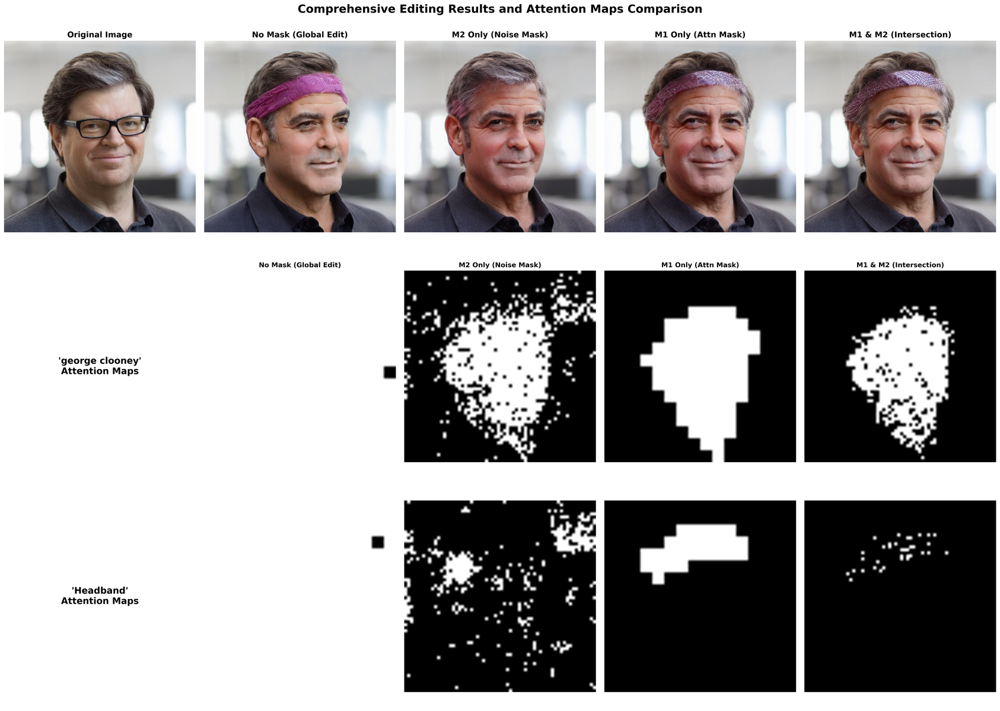
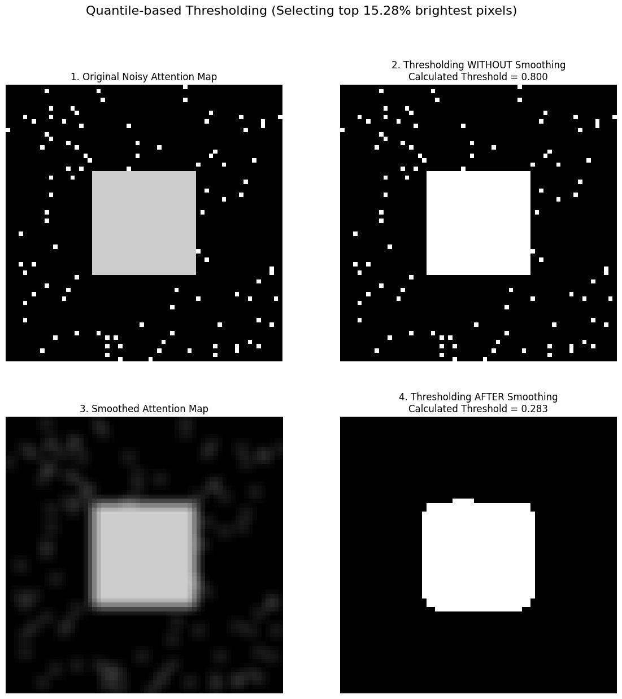

ledits++ 提出的计算掩码方法，会对每个编辑词分别算两种掩码，然后对这两种掩码求交集，再应用到这个概念词的编辑向量上：

- `$ \text{final\_mask\_clooney} \odot \left( \text{noise\_pred}\_{\text{clooney}} - \text{noise\_uncond} \right)  $`
- `$ \text{final\_mask\_sunglasses} \odot \left( \text{noise\_pred}\_{\text{sunglasses}} - \text{noise\_uncond} \right) $`

### 掩码可视化

下面先不管这两种掩码具体是怎么算的，先看它们分别长什么样子。



- 第一行第一列是原图，要编辑的图片。
- 第二到五列分别是不用掩码、只用M2，只用M1，用M1和M2的交集的效果。
- 第二行和第三行分别是两个编辑词计算出的掩码区域

分析：
- 不用掩码的时候，编辑区域很大，会对原图造成比较大的改动，比如人脸朝向变了
- 只用M2的时候，有些编辑词的区域，例如 headband，直接找不到，编辑失败。
- 只用M1就能描述了编辑词的区域
- 用两种掩码的交集，效果和只用M1其实差不多。论文里说用交集更好，可能是他试了不同的编辑任务，比如改风格之类的。

### 计算方法

下面来说这两种掩码是怎么算出来的。

首先，因为这个掩码最终的用途是和噪声预测相乘：

`$ \text{final\_mask\_clooney} \odot \left( \text{noise\_pred}\_{\text{clooney}} - \text{noise\_uncond} \right)  $`

所以他的维度必须和 noise_pred 的维度是一样的，在 SD1.5里就是 [1, 1, 64, 64]。

了解了这一点之后，再来看这两个掩码是怎么算的。

先解释容易理解的 M2 掩码。

#### M2 掩码

核心思想：

- 过滤掉编辑向量中的**弱信号区域**
- 保留编辑效果最强的区域

具体步骤：

1. **计算编辑强度**
   1. 先算出编辑向量: `$\text{edit\_vector} = \text{noise\_pred}\_{\text{clooney}} - \text{noise\_uncond}$`，维度是 [1, 4, 64, 64]
   2. 计算编辑向量的绝对值：`$|\text{edit\_vector}|$`，得到的矩阵维度是 [1, 4, 64, 64]
   3. 在通道维度求和，得到的矩阵维度是 [1, 1, 64, 64]
2. **确定阈值**: 基于分位数(如90%)计算强度阈值
   1. 将这个矩阵展平，得到一个一维向量，维度是 [1, 64*64]
   2. 计算这个向量的90%分位数，得到一个阈值 `$q_{90}$`
3. **生成掩码**: 将这个阈值 `$q_{90}$` 和矩阵比较，得到一个二值矩阵，维度是 [1, 1, 64, 64]

代码逻辑如下：

```python
def calculate_m2_threshold_mask(
    edit_vector,              # 编辑向量
    edit_threshold,           # 阈值参数 (如 0.9)
    device='cuda'
):
    """
    计算M2掩码：基于编辑向量强度的阈值掩码
    
    核心思想：
    - 分析编辑向量在空间上的强度分布
    - 只保留编辑强度最大的区域，过滤掉弱编辑区域
    - 避免编辑向量在不相关区域产生副作用
    
    Args:
        edit_vector: 编辑向量，形状为 [batch_size, 4, height, width]
        edit_threshold: 阈值参数，保留前(1-threshold)比例的强编辑区域
        device: 计算设备
    
    Returns:
        threshold_mask: M2掩码，形状与edit_vector相同
    """
    
    print(f"=== 计算M2掩码：基于编辑向量强度的阈值掩码 ===")
    print(f"编辑向量形状: {edit_vector.shape}")
    print(f"编辑阈值: {edit_threshold}")
    
    # 步骤1: 计算编辑向量的强度
    print("步骤1: 计算编辑向量强度")
    
    # 计算每个位置的编辑强度 (取绝对值并在通道维度求和)
    edit_intensity = torch.abs(edit_vector)  # 取绝对值
    edit_intensity = torch.sum(edit_intensity, dim=1, keepdim=True)  # 在通道维度求和
    edit_intensity = edit_intensity.repeat(1, 4, 1, 1)  # 复制到4个通道
    
    print(f"  - 编辑强度形状: {edit_intensity.shape}")
    print(f"  - 编辑强度范围: [{edit_intensity.min().item():.4f}, {edit_intensity.max().item():.4f}]")
    
    # 步骤2: 计算强度阈值
    print("步骤2: 计算强度阈值")
    
    # 将空间维度展平，计算分位数阈值
    intensity_flat = edit_intensity.flatten(start_dim=2)  # [batch_size, 4, height*width]
    
    # 根据数据类型选择合适的分位数计算方法
    if edit_intensity.dtype == torch.float32:
        threshold_values = torch.quantile(
            intensity_flat,
            edit_threshold,  # 例如0.9，表示保留前10%的强编辑区域
            dim=2,
            keepdim=False,
        )
    else:
        # 对于非float32类型，先转换再计算
        threshold_values = torch.quantile(
            intensity_flat.to(torch.float32),
            edit_threshold,
            dim=2,
            keepdim=False,
        ).to(edit_intensity.dtype)
    
    print(f"  - 阈值形状: {threshold_values.shape}")
    print(f"  - 阈值数值范围: [{threshold_values.min().item():.4f}, {threshold_values.max().item():.4f}]")
    
    # 步骤3: 生成阈值掩码
    print("步骤3: 生成阈值掩码")
    
    # 生成二值掩码：强度大于阈值的区域为1，否则为0
    threshold_mask = torch.where(
        edit_intensity >= threshold_values[:, :, None, None],  # 广播阈值
        torch.ones_like(edit_vector),   # 强编辑区域
        torch.zeros_like(edit_vector),  # 弱编辑区域
    )
    
    print(f"  - M2掩码形状: {threshold_mask.shape}")
    print(f"  - 掩码中1的比例: {threshold_mask.mean().item():.3f}")
    
    return threshold_mask
```


#### M1 掩码

核心思想：利用UNet的**交叉注意力机制**来定位编辑概念在图像中的语义相关区域。

这一部分涉及到理解 stable diffusion 里面的 unet 里面的交叉注意力机制，内容比较复杂，以后会单独写一篇文章来解释。

这里采用简单的理解：
1. 每个编辑词会得到一个注意力图，维度是 [16, 16]
2. 这个注意力图数值大的地方，说明和这个编辑词的相关性强。
3. 这里同样用了分位数来过滤，比如90%分位数，得到一个阈值 `$q_{90}$`
4. 为了和M2算交集，需要把这个注意力图插值到 64x64，并且用的是nearest模式，不会出现小数。
5. 最后得到一个二值掩码，维度是 [1, 1, 64, 64]

从之前的效果图也可以看到，交叉注意力图定位编辑区域更准：

- **'george clooney'** → 定位到人脸区域
- **'sunglasses'** → 定位到眼部区域

代码如下：

```python
def calculate_m1_attention_mask(
    attention_store,           # 注意力存储对象
    editing_prompt,           # 当前编辑概念 (如 'george clooney')
    num_edit_tokens,          # 编辑概念的token数量
    edit_threshold,           # 注意力阈值 (如 0.9)
    target_resolution=16,     # 注意力图分辨率
    latent_resolution=64,     # 潜在空间分辨率
    device='cuda'
):
    """
    计算M1掩码：基于交叉注意力的空间定位掩码
    
    核心思想：
    - 利用UNet中的交叉注意力图来定位编辑概念在图像中的位置
    - 通过阈值化处理生成二值掩码，指示哪些区域与编辑概念最相关
    
    Args:
        attention_store: 存储的注意力图
        editing_prompt: 编辑概念名称
        num_edit_tokens: 编辑概念包含的token数量
        edit_threshold: 注意力阈值，用于生成二值掩码
        target_resolution: 注意力图的分辨率
        latent_resolution: 潜在空间的分辨率
        device: 计算设备
    
    Returns:
        attention_mask: M1掩码，形状为 [batch_size, 4, latent_resolution, latent_resolution]
    """
    
    print(f"=== 计算M1掩码：基于交叉注意力的空间定位 ===")
    print(f"编辑概念: {editing_prompt}")
    print(f"编辑概念token数量: {num_edit_tokens}")
    print(f"注意力阈值: {edit_threshold}")
    
    # 初始化高斯平滑器
    smoothing = GaussianSmoothing(device)
    
    # 步骤1: 从注意力存储中聚合相关的注意力图
    print("步骤1: 聚合交叉注意力图")
    
    # 聚合来自UNet不同层的注意力图 (down_blocks 和 up_blocks)
    attention_maps = attention_store.aggregate_attention(
        attention_maps=attention_store.step_store,
        prompts=[editing_prompt],  # 当前编辑概念
        res=target_resolution,     # 16x16分辨率
        from_where=["up", "down"], # 从上采样和下采样块获取注意力
        is_cross=True,            # 交叉注意力
        select=0,                 # 选择第一个概念
    )
    
    print(f"  - 聚合后的注意力图形状: {attention_maps.shape}")
    # attention_maps形状: [batch_size, num_heads, 16, 16, seq_len]
    
    # 步骤2: 提取与编辑概念相关的注意力
    print("步骤2: 提取编辑概念相关的注意力")
    
    # 排除开始token (索引0)，只保留编辑概念的token
    concept_attention = attention_maps[:, :, :, 1:1 + num_edit_tokens]
    print(f"  - 概念注意力形状: {concept_attention.shape}")
    
    # 对所有编辑概念的token求平均
    concept_attention_avg = torch.sum(concept_attention, dim=3)  # 在token维度求和
    print(f"  - 平均后的概念注意力形状: {concept_attention_avg.shape}")
    # 形状: [batch_size, num_heads, 16, 16]
    
    # 步骤3: 对注意力图进行高斯平滑
    print("步骤3: 高斯平滑处理")
    
    # 添加padding并应用高斯平滑
    padded_attention = F.pad(concept_attention_avg.unsqueeze(1), (1, 1, 1, 1), mode="reflect")
    smoothed_attention = smoothing(padded_attention).squeeze(1)
    print(f"  - 平滑后的注意力图形状: {smoothed_attention.shape}")
    
    # 步骤4: 基于阈值生成二值掩码
    print("步骤4: 生成二值掩码")
    
    # 计算每个样本的阈值 (基于分位数)
    attention_flat = smoothed_attention.flatten(start_dim=1)  # [batch_size, 16*16]
    threshold_values = torch.quantile(attention_flat, edit_threshold, dim=1)
    print(f"  - 阈值数值: {threshold_values}")
    
    # 生成二值掩码
    attention_mask = torch.where(
        smoothed_attention >= threshold_values.unsqueeze(1).unsqueeze(1).repeat(1, target_resolution, target_resolution),
        1.0,  # 高注意力区域
        0.0   # 低注意力区域
    )
    
    print(f"  - 二值掩码形状: {attention_mask.shape}")
    print(f"  - 掩码中1的比例: {attention_mask.mean().item():.3f}")
    
    # 步骤5: 调整掩码分辨率以匹配潜在空间
    print("步骤5: 调整掩码分辨率")
    
    # 从16x16插值到64x64，并复制到4个通道
    final_mask = F.interpolate(
        attention_mask.unsqueeze(1),           # 添加通道维度
        size=(latent_resolution, latent_resolution),  # 目标分辨率64x64
        mode='nearest'
    ).repeat(1, 4, 1, 1)  # 复制到4个通道 [batch_size, 4, 64, 64]
    
    print(f"  - 最终M1掩码形状: {final_mask.shape}")
    
    return final_mask
```

#### 最终掩码

最终掩码是 M1 和 M2 的交集：

`$ \text{final\_mask} = \text{m1\_mask} \times \text{m2\_mask} $`

```python
final_mask = m1_mask * m2_mask  # 逐元素相乘
```

### 关于高斯平滑

在 LEDITS++ 的代码里，M1 掩码在二值化之前，做了高斯平滑，而 M2 掩码没做。

下面先解释高斯平滑有什么用，最后再解释为什么 M2 掩码不需要做。

对于一个注意力图，图里面的值都是0到1之间的小数，做高斯平滑的效果如下：



解释：
- 左上角是原始注意力图。
- 右上角是用原始注意图直接二值化，得到的掩码图。
  - 可以看到，直接二值化有一个问题，就是得到的掩码图噪声点太多
  - 而我们真正想要的主要是中间的白色方块区域
  - 通过高斯平滑，可以让孤立的噪声受到周围的影响，从而减弱对注意力图的整体的干扰
- 左下角就是对原始注意力图做高斯平滑的效果。可以看到，噪声点都已经被周围平均掉了
- 右下角就是对高斯模糊后的注意力图，二值化后的结果，会得到更干净的mask图。

#### 为什么 M2 掩码不用高斯平滑

那么为什么注意力图用高斯平滑，而 M2 掩码不用呢？

文章里说，M2 掩码是细粒度的掩码，主要是为了得到物体的边缘和轮廓，而不是为了得到一片编辑区域。

如果做了高斯平滑，那么物体边缘就会变淡，从而更难得到轮廓。